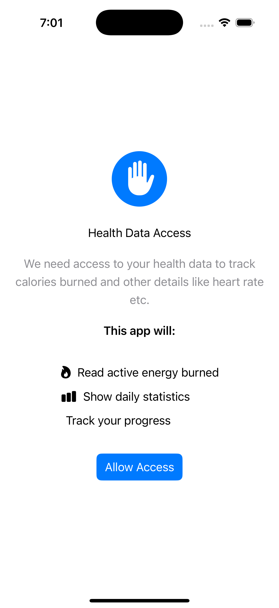
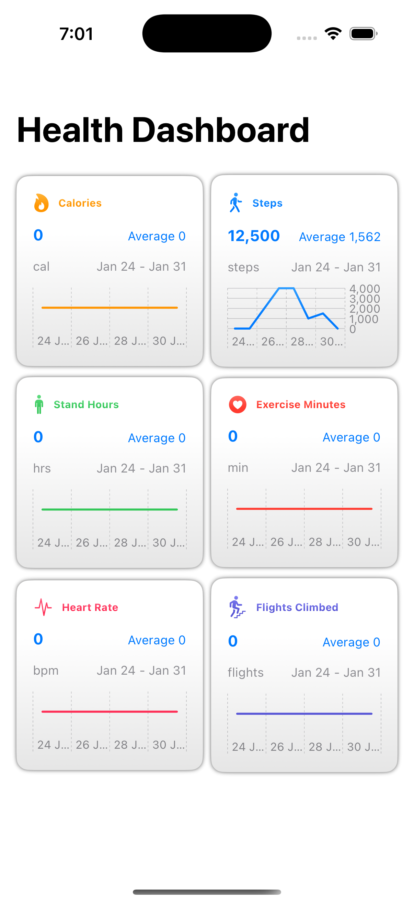
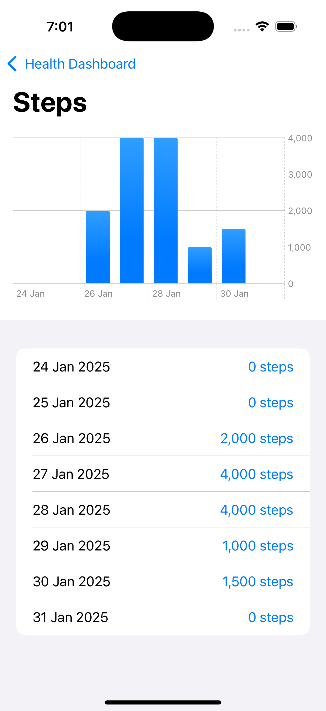

# HealthKitDashboard
This project showcases extraction of fitness data from iPhone using HealthKit libraries and showing them as charts in a SwiftUI based app.
below are the pages of the app:
## Permission Page:
- This page asks permission from the user to access the health data.

## Dashboard Page:
- This page shows mini charts for all the health metrics collected in the past 7 days.
- On clicking any of the charts, the app will navigate to the detils page.
- The data will be refreshed on pull.

## Details Page:
- This page shows details of selected metric from previous dashboard page in a chart format.
- It also shows the date wise data in list format below.
- The data will be refreshed on pull.

